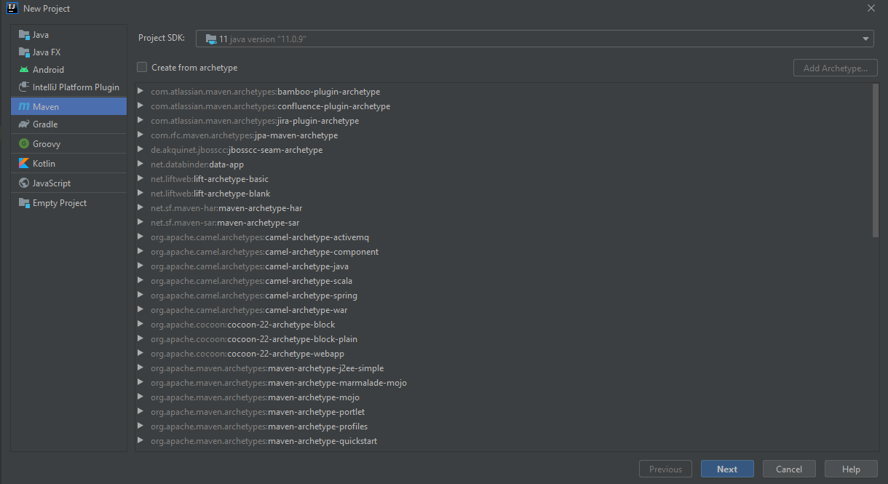
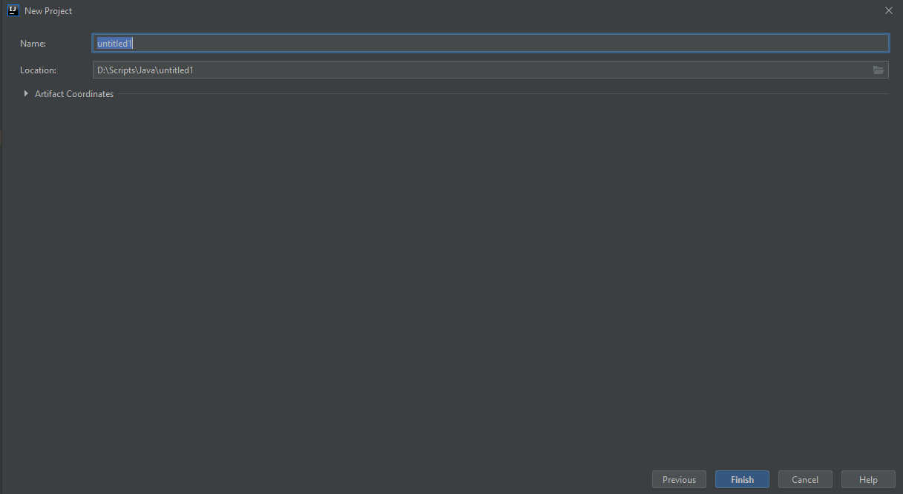
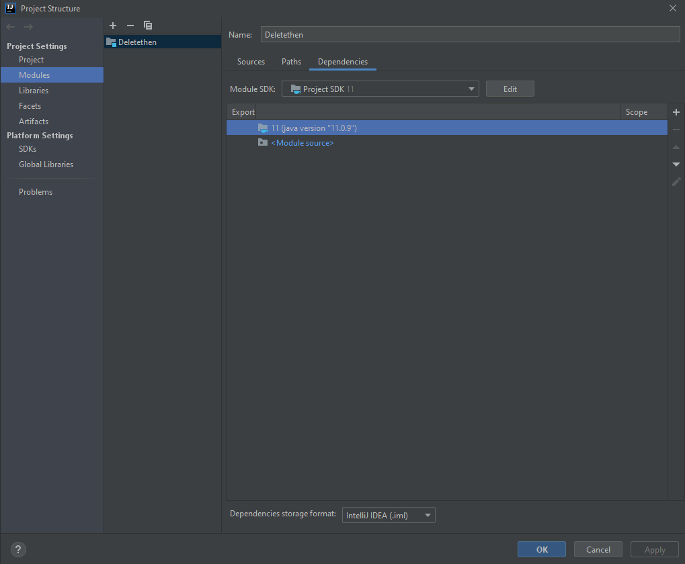
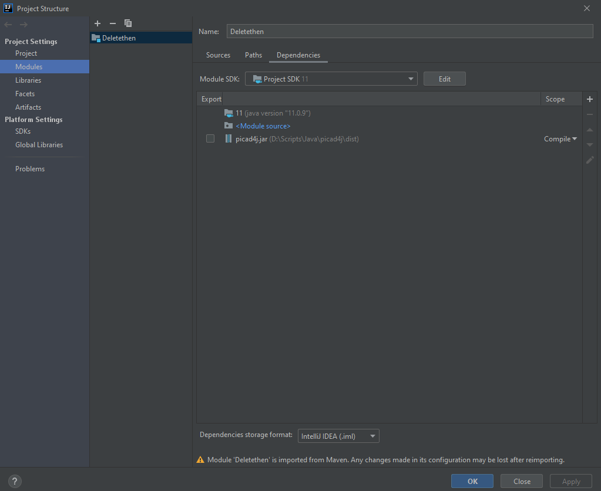
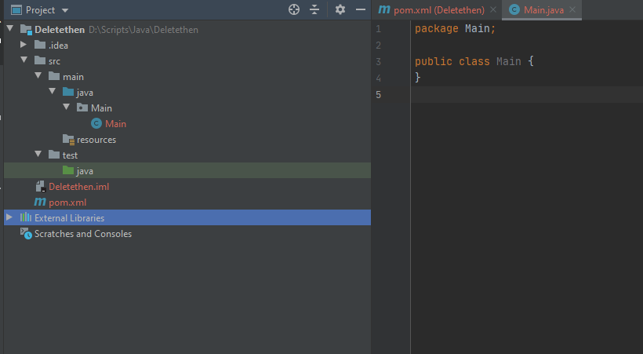
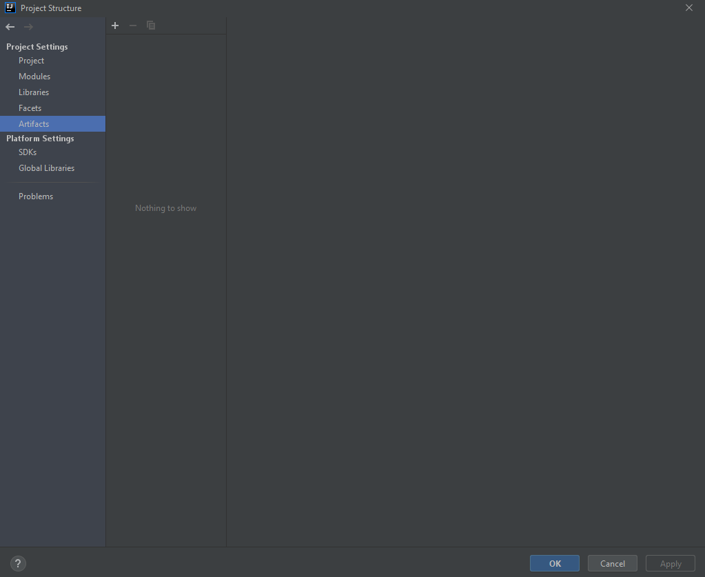
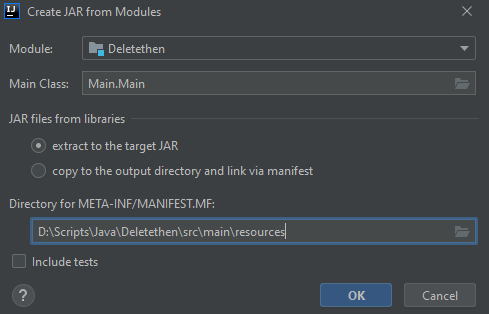

IntelliJ Project creation
======================================

Here is some info about how to create project on IntelliJ to use it via **shufflecad**.

Project creation:
^^^^^^^^^^^^^^^^^^^^^^^

1. Open Your IntelliJ -> click on **File** -> **New** -> **Project...**. Select **Maven** and SDK version - 11

2. Click **Next** -> Enter here your project name and its location -> **Finish**

3. Click **File** -> **Project Structure...** -> **Project Settings** -> **Modules** -> **Dependencies** -> click on plus button -> **1 JARs or directories**

4. Select **picad4j.jar** file -> **Apply** -> **OK**

5. Create a package inside java folder -> create main class inside it

6. Click **File** -> **Project Structure...** -> **Project Settings** -> **Artifacts** -> click on plus button -> **JAR** -> **From modules with dependencies...**

7. Select here your Main class and inside **Directory for META-INF...** at the end of the line instead of *java* writedown *resources* -> **OK** -> **Apply** -> **OK**

8. Now your project tree should look like this

.. image:: imgs/nineth_step.PNG
   :align: center
   :width: 800

8. Then click on **Build** -> **Build Artifacts...** -> Select your artifact -> **Build**
