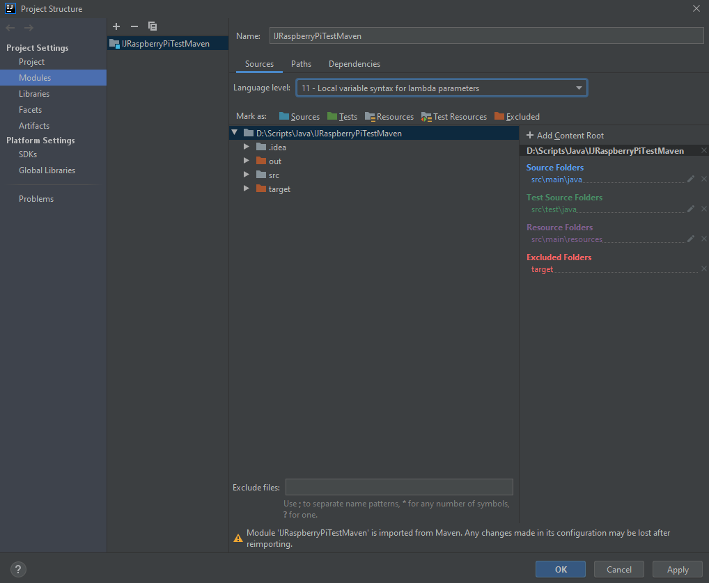
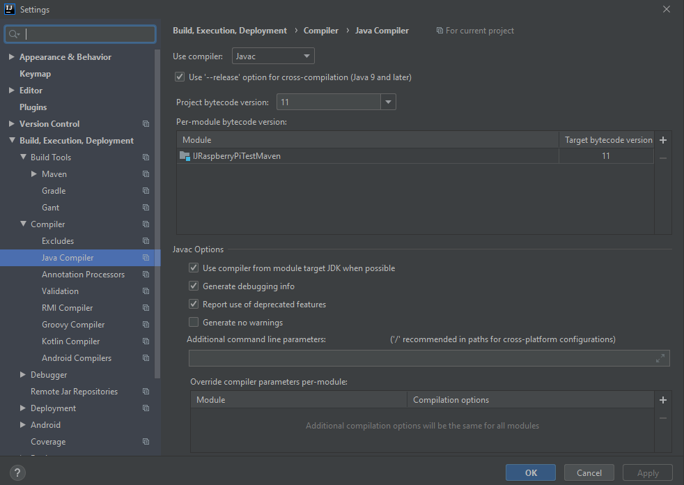

IntelliJ Useful Tips
======================================

There could be some errors in your project - here is some possible solutions.

Useful tips:
^^^^^^^^^^^^^^^^^^^^^^^

1. Click on **File** -> **Project Structure...** -> **Modules** -> **Sources**. Select 11 version inside **Language level:** -> **Apply** -> **OK**

2. Click on **File** -> **Project Settings** -> **Build, Execution, Deployment** -> **Compiler** -> **Java compiler**. Select 11 version inside **Projectbytecode version** and **Target bytecode version** of your project

