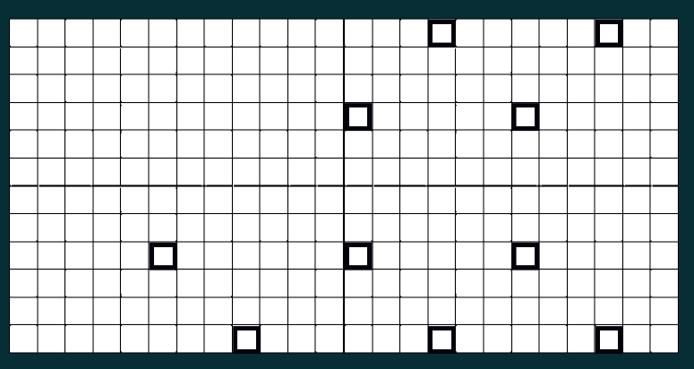

Toolcad Gurneys
======================================

Here is the *Gurneys* Page:

.. image:: imgs/gurney_1.PNG
   :align: center
   :width: 600 

Imagine we have this strange and shity field (1337/1488 shakals):

.. image:: imgs/gurney_2.PNG
   :align: center
   :width: 600 

So lets select approximate places where gurneys could be spawned by clicking on them:

On the right side you can manage how many of gurneys you want to be spawned:

.. image:: imgs/gurney_4.PNG
   :align: center
   :width: 200 

*Random* button will randomize gurneys, *Clean* button will clear everything on the field except selected places and *Clean All* will clean everything.

*Status* will show you if everything is OK if not check out page with error codes.