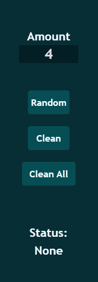
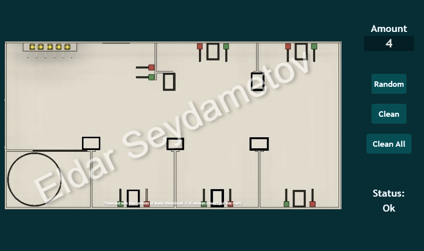

Toolcad Gurneys
======================================

Here is the *Gurneys* Page:

.. image:: imgs/gurney_1.PNG
   :align: center
   :width: 600 

Imagine we have this strange and shity field (1337/1488 shakals):

So lets select approximate places where gurneys could be spawned by clicking on them:

.. image:: imgs/gurney_3.PNG
   :align: center
   :width: 600 

On the right side you can manage how many of gurneys you want to be spawned:

Also you can upload you own image using *Settings Page*. For example I have this image:

And then I upload it by disabling *Default Field* setting and clicking on the *Choose Field* button. Then I select the image I want to upload. And then I click *Save* button in *Settings Page*.

Now I have *Gurneys Page* look like this:

Then I place squares approximately near the places where they can be and press *Random* button:

*Random* button will randomize gurneys, *Clean* button will clear everything on the field except selected places and *Clean All* will clean everything.

*Status* will show you if everything is OK if not check out page with error codes.