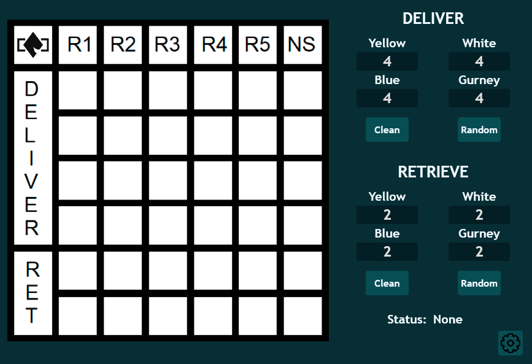
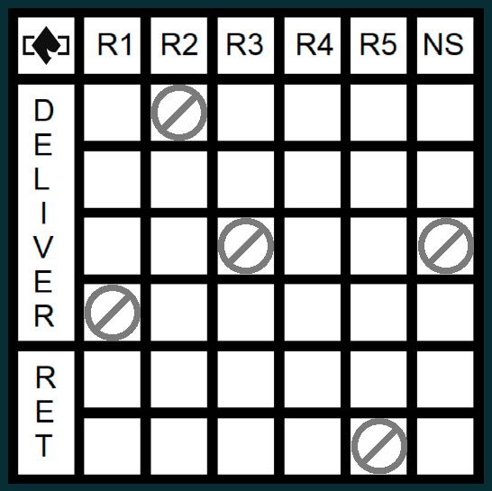

Toolcad Order Board
======================================

Here is the *OrderBoard* Page:

You can select cells where you don't want elements to be spawned by clicking on them:

On the right side you can manage how many of each elements should be spawned on the DELIVER and RET sides of the *OrderBoard*:

*Random* button will randomize elements and *Clean* button will clear everything on the *OrderBoard* except forbidden cells:

*Status* will show you if everything is OK if not check out page with error codes:

