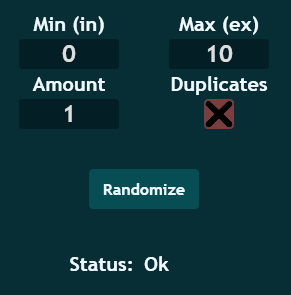

Toolcad Random
======================================

Here is the *Random* Page:

On the center you can see the result of the random. On the right side you can manage your randomizer. *Min* - min value (includive), *Max* - max value (exclusive), *Amount* - amount of numbers your want to be randomized and *Dublicates* - if true there could be dublicates in a randomized sequence, if false there won't be dublicates:

*Status* will show you if everything is OK if not check out page with error codes: