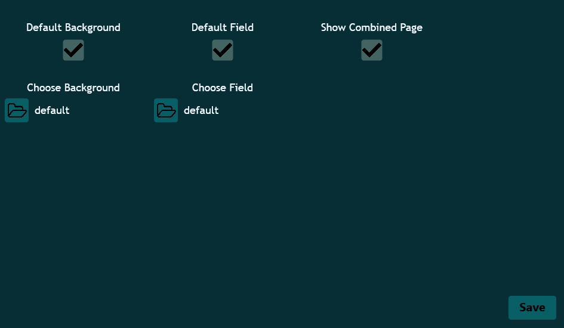
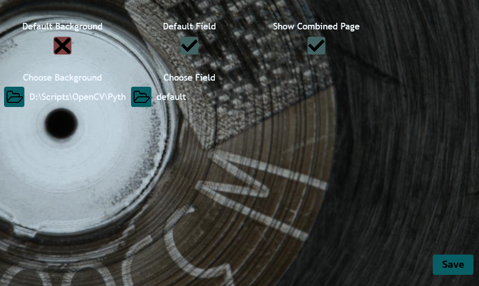

Toolcad Settings
======================================

Here is the *Settings* Page:

Here you can change apps background by setting *Default Background* to False state and choosing you image:

By disabling *Default Field* toggler and selecting your image in *Choose Field*, you can change image in *Gurneys Page*.
  
Also you can enable and disable *Combined Page* button.  

After every change you should click *Save* button!