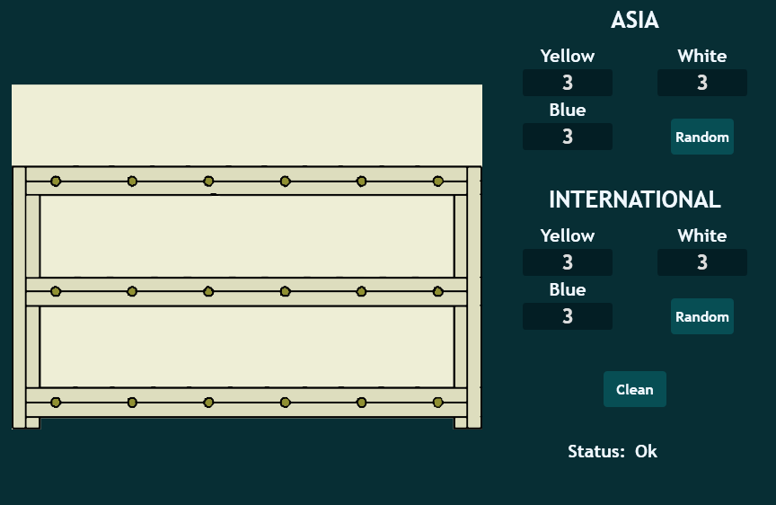

Toolcad Shelf
======================================

Here is the *Shelf* Page:

You can select places where you don't want cubes to be spawned by clicking on them:

.. image:: imgs/shelf_2.PNG
   :align: center
   :width: 350

On the right side you can manage how many of each cube you want to be spawned. There are two different modes of cube spawn: *ASIA* and *INTERNATIONAL*. *ASIA*: yellow cubes will spawn on the first floor, blue - on the second and white - on the third. *INTERNATIONAL*: different cubes will spawn in different places:

*Random* button will randomize cubes and *Clean* button will clear everything on the *Shelf* except forbidden places.

*Status* will show you if everything is OK if not check out page with error codes.
