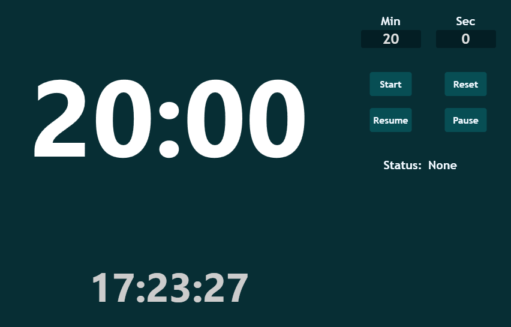
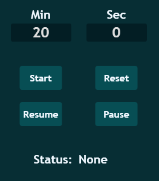

Toolcad Timer
======================================

Here is the *Timer* Page:

On the center you can see your timer and your current time:

On the right side you can manage timer settings. *Start* buttons will start timer. *Reset* - will reset. *Resume* - will resume if it is paused. *Pause* - will pause.

*Status* will show you if everything is OK if not check out page with error codes: