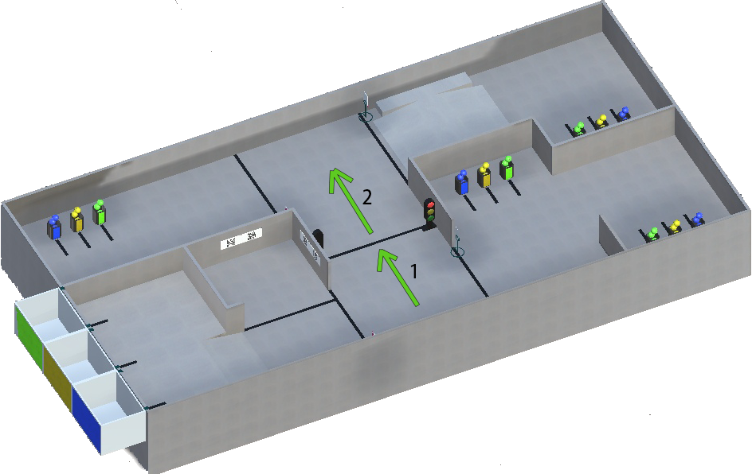
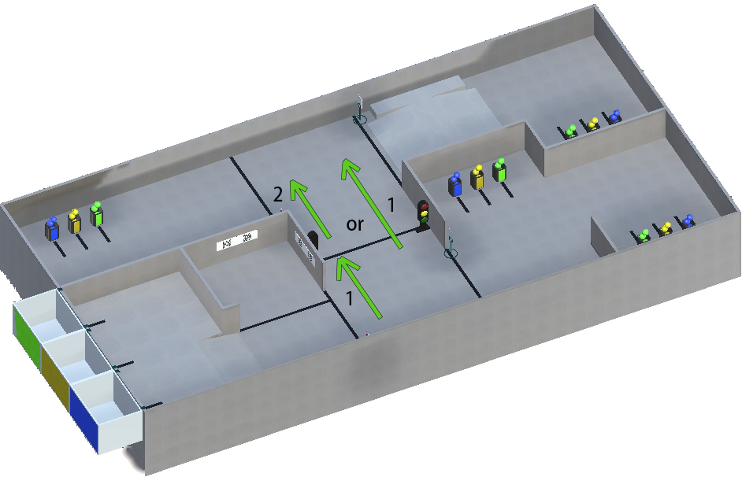
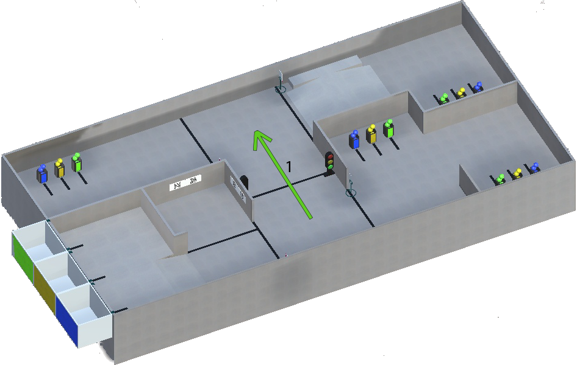

Traffic lights on E21 field
======================================

There are 2 traffic lights on the field and they can burn with such colors:

- **Red** color
- **Yellow** color
- **Green** color

Red:
"""""""""""""""""""""""""""""""
If a **red** light is on at a traffic light, robot should stop in front of it or in front of a black line. And continue movement when a **green** light is on at a traffic light:

Yellow:
"""""""""""""""""""""""""""""""

If a **yellow** light is on at a traffic light, robot should stop in front of it or in front of a black line. And continue movement when a **green** light is on at a traffic light.
**But** if robot already crossed the line when the yellow light came on, it can complete movement:

Green:
"""""""""""""""""""""""""""""""

If a **green** light is on at a traffic light, robot can continue its movement:

