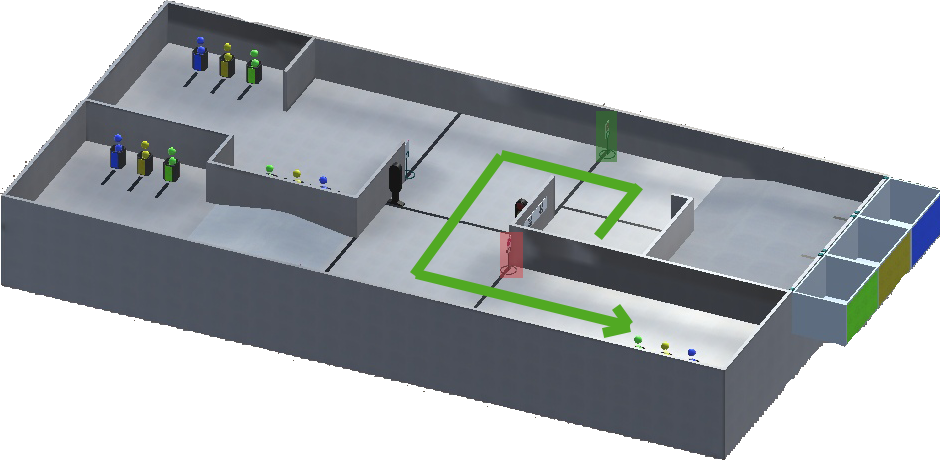
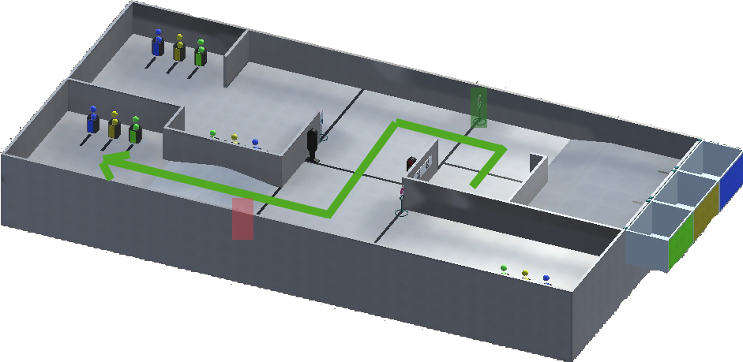
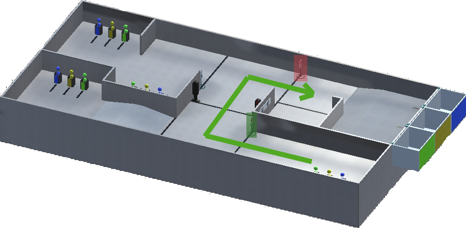
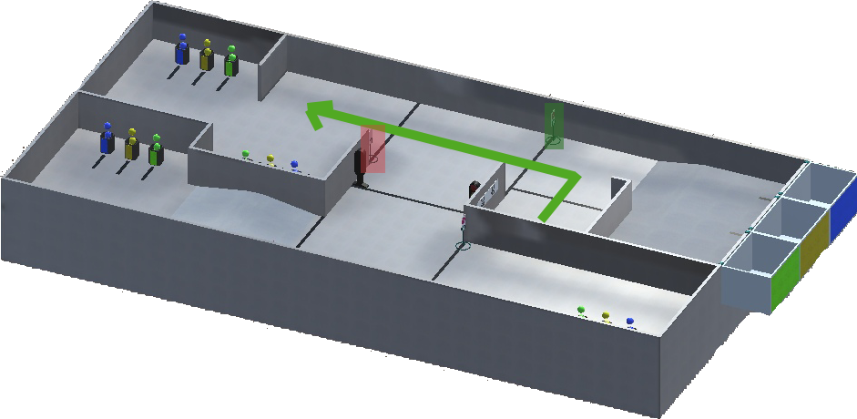
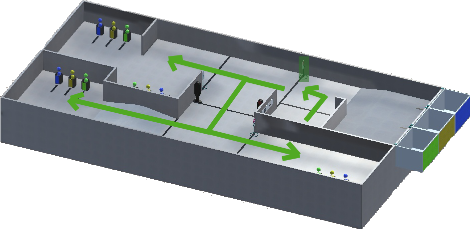
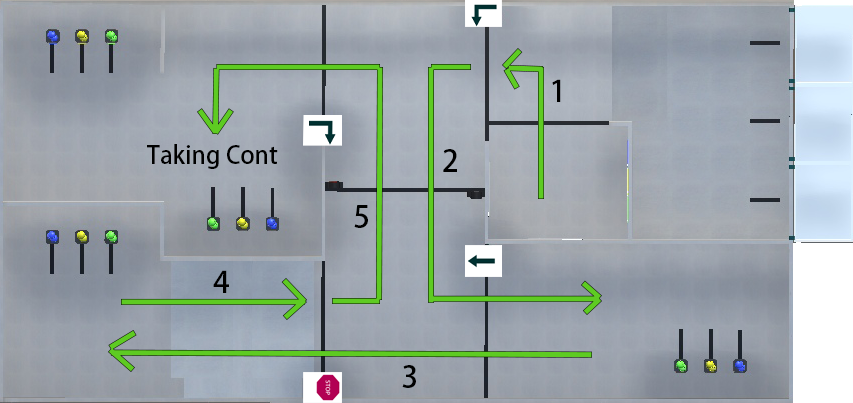
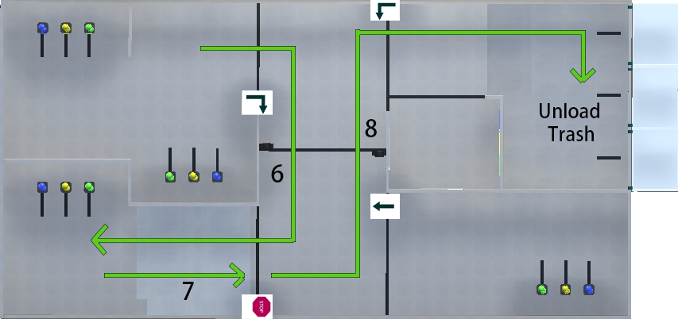

Signs on E21 field
======================================

There are 4 signs on the field and they may be:

- **Turn Left** sign
- **Turn Right** sign
- **Move Forward** sign
- **Stop** sign

Turn Left:
""""""""""""""""""""""""""""""""

For example, if You have **Turn Left** sign at the start (green rect) You should move like that:

or like that:

and check next sign (red rect) if You need it.

Turn Right:
""""""""""""""""""""""""""""""""

For example, if there is **Turn Right** sign at the Distant village (green rect) You should move like that:

or like that:

.. image:: pics/right_example_2.png
   :align: center
   :width: 900

and check next sign (red rect) if You need it.

Move Forward:
""""""""""""""""""""""""""""""""

For example, if there is **Move Forward** sign at the start (green rect) You should move like that:

and check next sign (red rect) if You need it.

Stop:
""""""""""""""""""""""""""""""""

For example, if there is **Stop** sign at the start (green rect) You should stop in front of the sign (or line) and wait for 2 seconds. After that You can continue Your movement wherever You want. Example:

All signs:
""""""""""""""""""""""""""""""""

Here is an example of movement when robot has to go to the Pine village and take containers from there:

