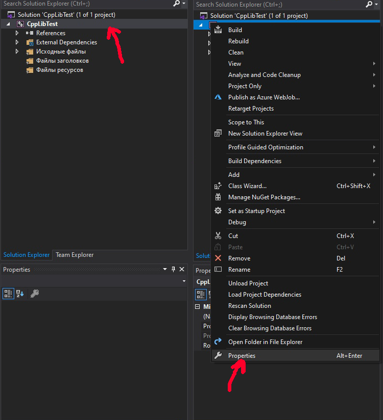
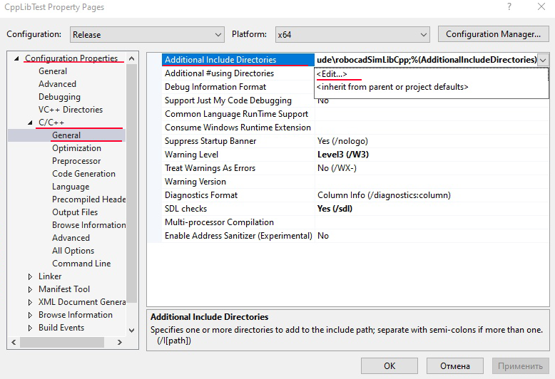
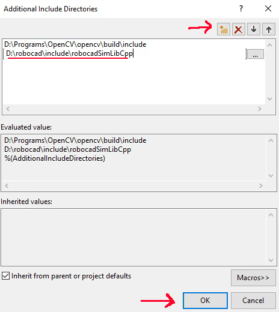
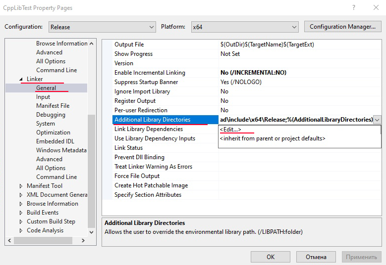
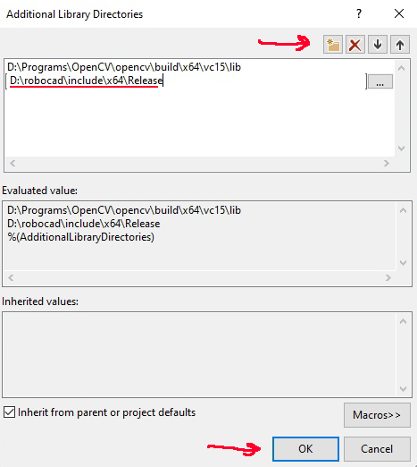
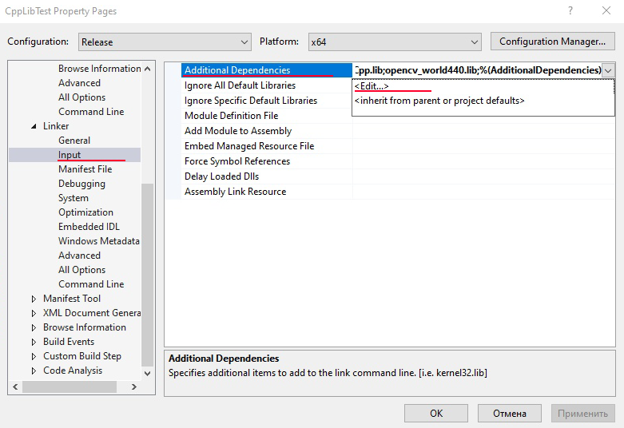
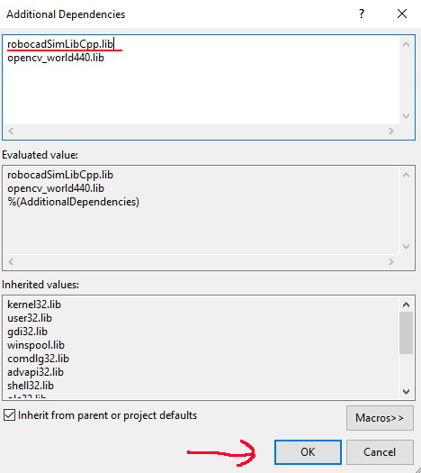

C++ library
======================================

Here is some info about how to use robocadSim C++ library in your project. I am going to use Visual Studio 2019.

1. You need open-cv installed in your project. `(How to install example). <https://www.youtube.com/watch?v=M-VHaLHC4XI>`__  
2. Right click on Your project name in **Solution explorer** -> **Properties**

  
  
3. Click on **Configuration Properties** -> **C/C++** -> **General** -> **Additional Include Directories** -> **Edit**

4. Create a new line and paste here path to C++ header files (./robocadSim/Lib/cpp/robocadSimLibCpp) -> click **OK**  

5. Go to **Linker** -> **General** -> **Additional Library Directories** -> **Edit**

6. Create new line and paste here path to **.lib** file (./robocadSim/Lib/cpp/x64/Release) -> click **OK**

7. Go to **Linker** -> **Input** -> **Additional dependencies** -> **Edit**

8. Paste here robocadSimLibCpp.lib line -> click **OK**

9. Now You can use robocadSim C++ library in Your project!

If You can't use some header files:
^^^^^^^^^^^^^^^^^^^^^^^^^^^^^^^^^^^^^^

1. Copy **.dll** file in robocadSim release folder (./robocadSim/Lib/cpp/x64/Release)
2. Paste it to the path: **path_to_your_project/your_project_name/your_project_name/**