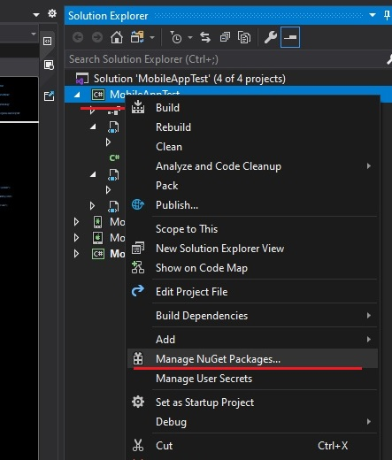
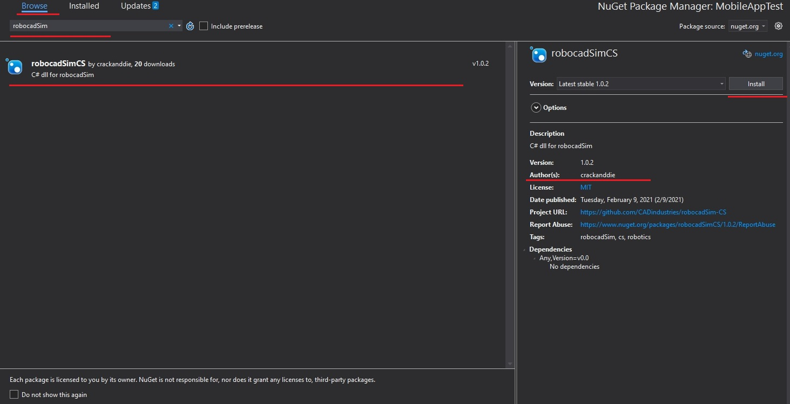
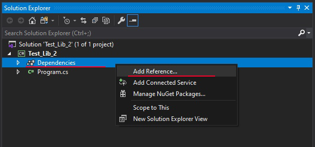
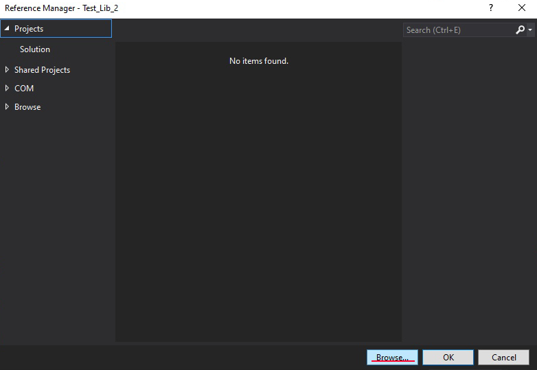
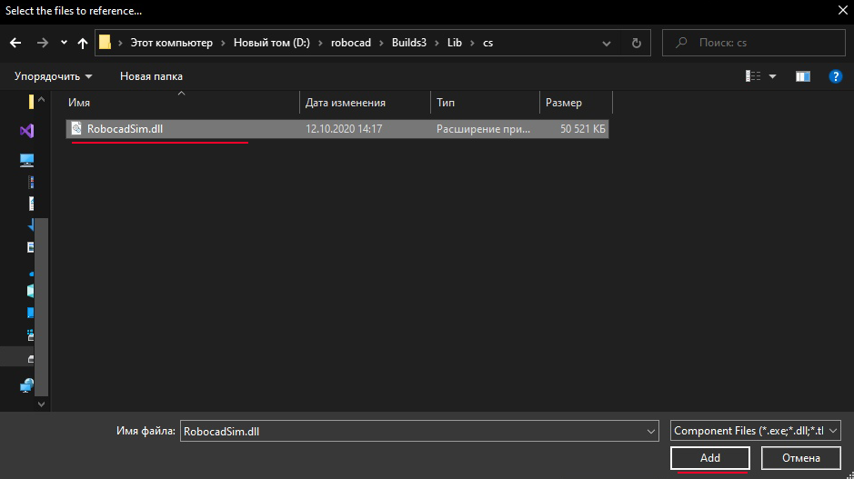

C# library
======================================

Here is some info about how to use robocadSim C# library in your project. I am going to use Visual Studio 2019.

You need emgu-cv installed in your project if You use robocadSim version < v1.3.7. `(How to install example). <https://www.youtube.com/watch?v=8PoonbKW7YI>`__  

First way:
^^^^^^^^^^^^^^^^^^^^^^^

1. Right click on Your project name in **Solution explorer** -> click on **Manage NuGet Packages**

2. Click on **Browse** -> write there **robocadSim** and click Enter -> choose **robocadSimCS** created by **crackanddie** or **Abdrakov corp.** and click on install button

Second way:
^^^^^^^^^^^^^^^^^^^^^^^

1. Click on Your project name in **Solution explorer** -> right click on **Dependencies** -> **Add reference...**

2. Click on **Browse...**

3. Select **RobocadSim.dll** in **./Lib/cs/** and click **Add**

4. Now You can use robocadSim C# library in Your project!