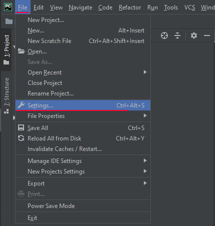
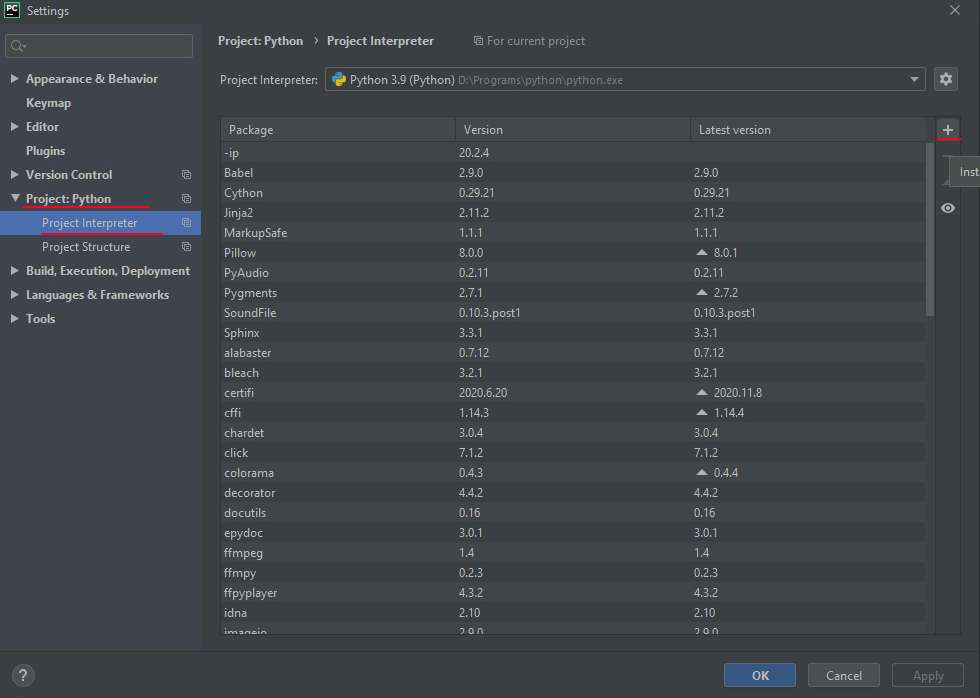
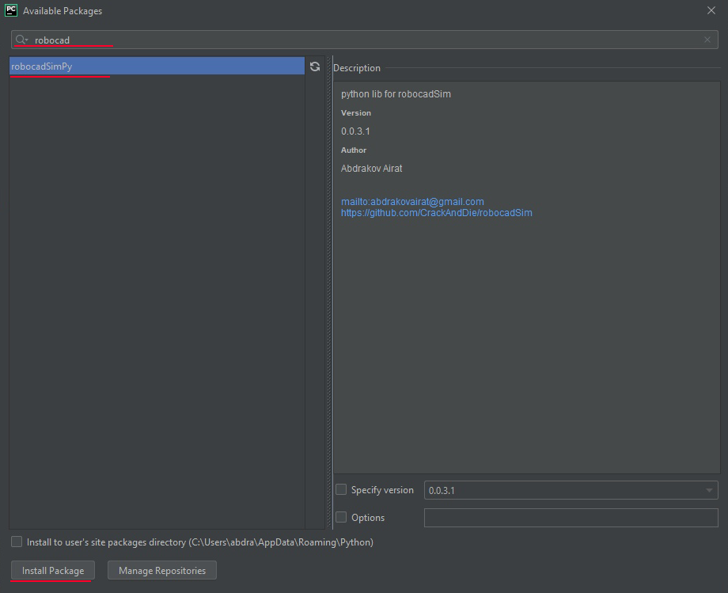
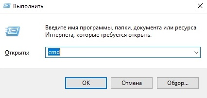
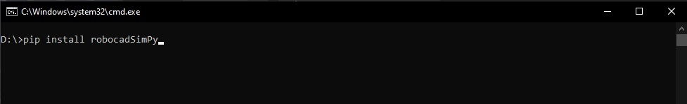
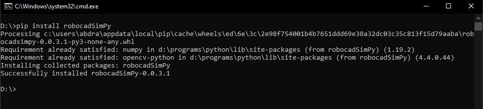

Python library
======================================

Here is some info about how to download robocadSim Python library. I am going to use PyCharm 2020.

First way:
^^^^^^^^^^^^^^^^^^^^^^^

1. Open Your project in PyChram -> click on **File** -> **Settings**

2. Click on **Project: Python** -> **Project Interpreter** -> **Install** (Plus button)

3. Write **robocadSimPy** in **Search Line** -> select **robocadSimPy** -> click **Install Package**

4. Now You can use robocadSim Python library in Your project!

Second way:
^^^^^^^^^^^^^^^^^^^^^^^

1. **Win + R** -> write **cmd** here -> press **Enter**

2. Write here **pip install robocadSimPy** or **pip3 install robocadSimPy** -> press **Enter**

3. Now You can use robocadSim Python library in Your project!